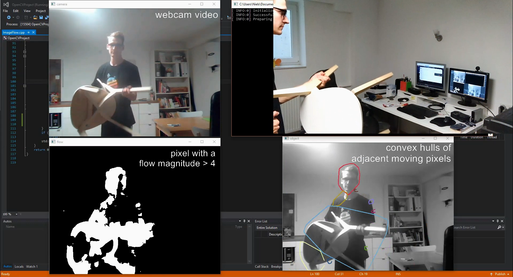

# Fast Image Flow based Label Editor

A tool to create bounding boxes and labels for moving objects in mostly static videos.

## Idea

On a low level objects are defined by humans by "belonging" together.
This can be identified by them sharing a direction of movement and being physically near.
Among frames objects can be grouped by near objects in the preceding frames.
Thus different views of the same object get grouped together.

All this program does is computing the image flow in a camera image.
Then it groups pixels based on whether they are pyhsically near and moving.
The groups are marked in the output by a bounding box.

As this only uses a minimal amount of algorithms, the resulting output is really fast. 
When provided with some hint about what is actually moving in the video,
the result is a lot of labeled frames of an input video, that can be used i.e. to train a neural network like yolo.

## Libraries

For image processing OpenCV is used. If you want to build this yourself, make sure OpenCV is set up correctly on your system and in your IDE.

## Demo Video

## TO-DOs

 - create label files
 - enable inputting a label for all bounding boxes (i.e. only one object is moving in the whole video)
 - Invoke an image classifier to automatically derive labels for the bounding boxes
 - Group images based on whether they move in the same direction.
 - move to-dos to the issue section
