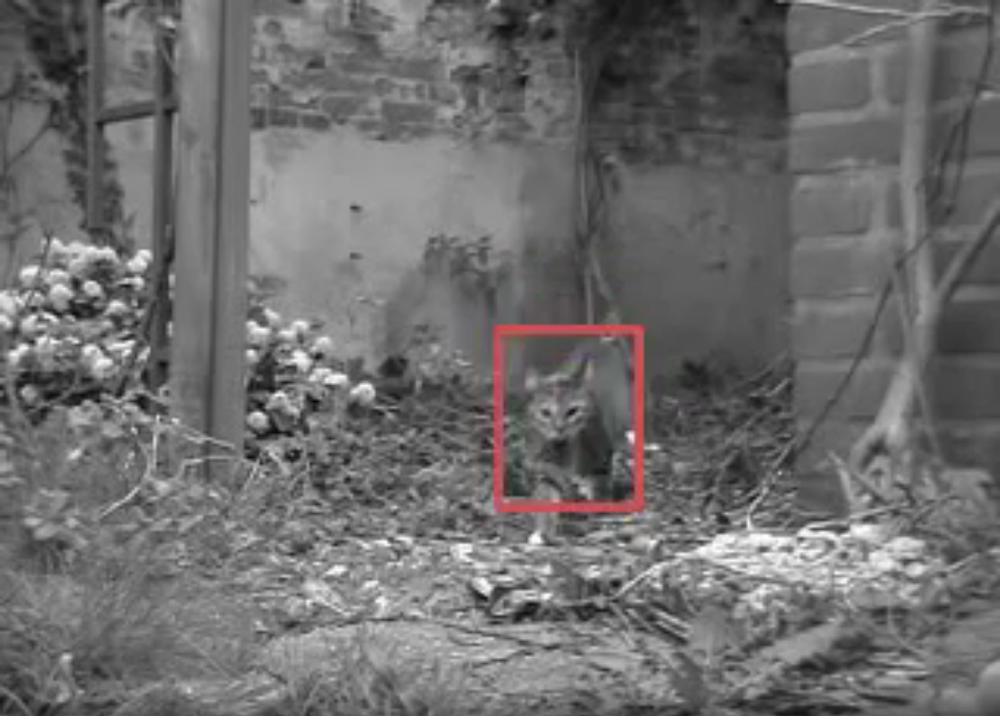

# FlowDetect

This is a small holiday project trying to detect what humans describe as "objects" by inspecting visual flow in an image.

## Idea

All this program does is computing the image flow in a camera image. Then it groups pixels based on whether they are pyhsically near and moving. The groups are marked in the output by their corresponding convex hull.

As this only uses a minimal amount of algorithms, the resulting output is really fast. Yet it also resembles a lot how humans detect objects. At least this is assumed, as there is nothing else about objects than "belonging" together. This is identified by them sharing a direction of movement and being physically near. Among frames objects can be grouped by near objects in the preceding frames. Thus different views of the same object get grouped together.

## Libraries

For image processing OpenCV is used. If you want to build this yourself, make sure OpenCV is set up correctly on your system and in your IDE.

## Demo Video

## More on the Idea

It is asserted for this project, that the system has a camera for surveying its environment.
This camera provides the system with a video stream, composed of singular frames.

As objects often are defined as "things that can be seperated from the surrounding"
this approach bases on the idea of objects primary as things that show movement on their own,
do not move together with their surrounding or at least can be made to do so.

To detect where in an image objects are, the following steps are executed

1. **Remove** parts of the image that qualify as **background**

   In this sense, background is everything that does not show movement on its own,
   different from the environment visible in the image.
   To distinguish nonmoving background, we first compute the visual flow of two adjacent
   video frames, resulting in a map of pixel->shift/movement/flow.

   A mean movement is computed as mean of all shifts. As we assert that the main part of the image
   will be background (objects are simple small things at first, only those that show
   distinguished movement are aimed for), by removing this mean shift of the image,
   the largest part of the background movement created by camera movement is discarded.

   Removing the "background" shift is done by shifting all pixels in the second frame
   by the inversed mean flow (opposite direction).

2. **Highlight** parts of the image with **distinguished movement**

   Now on the resulting frames of the first step, we compute imageflow again (or we simply
   subtract the mean flow from all pixels in the first steps). The leftover shifts are
   filtered simply by applying a threshold magnitude of shift (i.e. 4 pixels) on the
   pixelshifts. In the next steps only those pixels will be regarded that pass through this
   filtering.

3. **Detect connected components** among the flowing pixels

   Among the resulting pixels and their movements, we want to check for connections, as
   per above definition objects are all the stuff that shows distinguished movement, is
   as a mass separable from its environment.

   For this we use a simple connected components algorithm, using efficient union find
   structures to store the component of which a pixel is part of.

   To also regard the direction of movement (it can be asserted that all parts of an
   object do have similar movement (TODO what about rotation?)) we can include
   information on the pixels direction. It is only included in the respective component
   of near pixels if it does not show more than i.e. 45° deviation from the mean direction
   of the component in question (the mean can be computed by storing the average and
   the amount of pixels, than the new mean is computed by multiplying the average by
   the amount of pixels, adding the new direction and dividing by n+1).

4. **Tag objects and train on them**

   Aim of the system should be to tag images of similar objects (in the eyes of humans)
   with similar tags (in mathematical meaning). We can use the fact that a video stream is
   used to achieve this.

   First of all, a machine learning mechanism (most likely a neural network approach should
   do) can be used to create a function, mapping pixel regions (a rectangular region is
   the simplest and can be used, following referred to as ROI) to object tags.
   ROIs in adjacent frames (near in time dimension) and with similar coordinates (near
   in spacial dimension) are very likely to belong to the same object (if time and space
   restriction is strong enough), so the machine learning system should be trained
   on mapping those ROIs to similar, if not the same tags.

   An initial tag for the first frame of an object in the stream (any new object) can
   be produced by feeding it to the machine learning system (the empty would result in
   a random tag, a trained system will return the tag of a similar object).

   Problems do arise when the an object is first visible from one perspective, thus
   consecutive object perspectives are trained on tag 1. The the same object is visible
   from a totally different perspective, resulting in a new tag (2). All consecutive
   ROIs associated with this perspective are trained to the new tag - even if at
   some point, due to rotation of the object, the ROIs are the same or very similar to
   the ROIs from the first view. Experiments shall be conducted to test if this leads to
   serious problems or if this is compensated by large amounts of data.

5. **Developing a knowledge database**

   Approaches for storing ROIs and tags (i.e. for cache or raw storage) is sparse memory,
   storing pixel ROIs at their tags position. Similar objects can then be retreived easily
   by their tag.

   Also in a database of some kind, associations between objects can be stored. If objects
   do appear in the same frame, they'd increase in association (until a point where
   correlation or even causation could be extracted). The exact way of storing shall be
   researched into.

## TO-DOs

 - Group images based on whether they move in the same direction.
 - Train a machine learning based system on what pixels belong together in one object group. Take into account possible tracking results and time and location proximity
